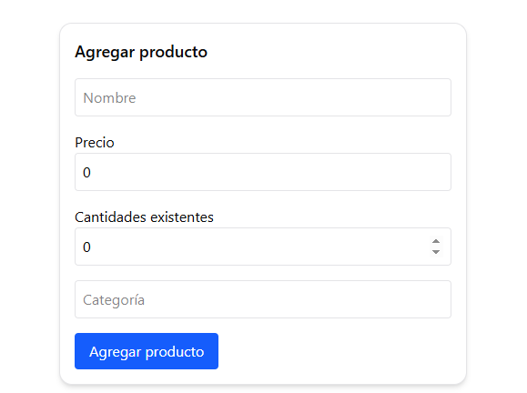
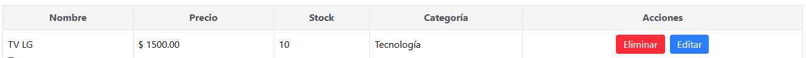
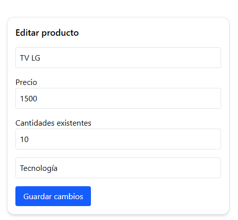

# Inventario de Productos

Proyecto en desarrollo orientado a la gestión de productos mediante una interfaz web. Esta etapa corresponde únicamente al frontend, construido con React y Next.js. El backend y la integración con base de datos serán implementados en futuras etapas.

## Tecnologías utilizadas

- Next.js (App Router)
- React
- TypeScript
- Tailwind CSS
- Shadcn 

## Funcionalidades implementadas (Frontend)

- Registro de productos con campos: nombre, precio, stock y categoría.
- Edición de productos existentes.
- Eliminación de productos.
- Tabla interactiva para visualizar la información.
- Interfaz modular, escalable y responsiva.

## Imagenes del proyecto






## Estado actual del proyecto
Este proyecto se encuentra en fase inicial. Actualmente se simulan los datos en memoria, sin persistencia. La próxima fase contempla:

- Integración con base de datos utilizando Prisma.

- Creación de una API con rutas internas de Next.js.

- Validación de formularios y manejo de errores.


## Instrucciones para ejecución local

1. Clonar el repositorio:

```bash
git clone https://github.com/devkopi/invetario-productos.git
```

> Navegas hasta la ruta donde clones el repositorio y sigues con las instrucciones

2. Instala dependencias
```bash
npm install
```
3. Ejecuta el entorno
```bash
npm run dev
```
---